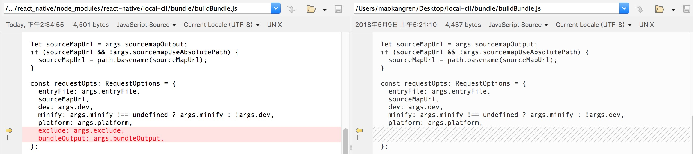

### 0: 安装工具
```
npm install -g react-native-cli
npm install -g install-local
```

### 1: 在线调试
* 在纯的 rn 项目开启服务 **npm run start** 查看本地 IP 为 *10.10.10.111*
* 设置 **IP:PORT** *10.10.10.111:8081* (Dev Settings -> Debug server host & port for device)


### 2: 发布离线包
```
// bundle
react-native bundle  --platform android  --dev true  --entry-file ./index.js  --bundle-output ./build/bundle/assets/index.android.bundle  --assets-dest ./build/bundle/res/

// unbundle
react-native unbundle  --platform android  --dev true  --entry-file ./index.js  --bundle-output ./build/bundle/assets/index.android.bundle  --assets-dest ./build/bundle/res/
```

* base & business for android
```
react-native   bundle  --platform android --verbose --minify false --dev true  --entry-file ./common_entry.js  --bundle-output ./build/bundle/base/bundle/base.android.bundle --assets-dest ./build/bundle/base/bundle
react-native   bundle  --platform android --verbose --minify false --dev true  --entry-file ./index.js  --bundle-output ./build/bundle/business/bundle/business.android.bundle --assets-dest ./build/bundle/business/bundle --exclude  ./build/bundle/base/bundle/base.android.bundle.json
```

* base & business for ios
```
react-native   bundle  --platform ios --verbose --minify false --dev true  --entry-file ./common_entry.js  --bundle-output ~/Desktop/base/base.ios.bundle --assets-dest ~/Desktop/base
react-native   bundle  --platform ios --verbose --minify false --dev true  --entry-file ./index.js  --bundle-output ~/Desktop/business/business.ios.bundle --assets-dest ~/Desktop/business --exclude  ~/Desktop/base/base.ios.bundle.json
```
* normal for android bundle and unbundle
```
react-native unbundle  --platform android  --verbose --minify false --dev true  --entry-file ./index.js  --bundle-output ./build/bundle/normal/unbundle/index.android.bundle --assets-dest ./build/bundle/normal/unbundle
react-native   bundle  --platform android  --verbose --minify false --dev true  --entry-file ./index.js  --bundle-output ./build/bundle/normal/bundle/index.android.bundle --assets-dest ./build/bundle/normal/bundle
```


# Custom Metro To Split Modules For React Native

🚇 Reference Metro From Native Path
- **🚅 build es6 to es5**: 
```
cd ~/workspace/smart-metro
npm run build-clean && npm run build
```
- **🚅 publish local release**: 
```
cd packages/metro
npm run package-release

```
- **🚅 install local**: 
```
npm install -g install-local

cd ~/workspace/ReactNativeProject
rm -rf node_modules/metro
install-local --save ~/workspace/smart-metro/packages-release/metro
```
- **🚅 install and update local with one key**:

```
cd ~/workspace/smart-metro/ && npm run build-clean && npm run build && cd packages/metro && npm run package-release && cd ~/workspace/template/apps/app-template/react_native && install-local --save ~/workspace/smart-metro/packages-release/metro
```

# node_modules/react-native/local-cli/bundle modify
* 1 bundleCommandLineArgs.js add command
    ```
        command: '--exclude [string]',
        description: 'Manifest file name where modules to exclude are stored, ex. /tmp/manifest.json',
      }, {
    ```
    

* 2 buildBundle.js

   * from:
        ```
          const requestOpts: RequestOptions = {
            entryFile: args.entryFile,
            sourceMapUrl,
            dev: args.dev,
            minify: args.minify !== undefined ? args.minify : !args.dev,
            platform: args.platform,
          };
        ```

   * to:
        ```
          const requestOpts: RequestOptions = {
            entryFile: args.entryFile,
            sourceMapUrl,
            dev: args.dev,
            minify: args.minify !== undefined ? args.minify : !args.dev,
            platform: args.platform,
            exclude: args.exclude,
            bundleOutput: args.bundleOutput,
          };
        ```
   