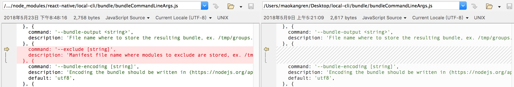
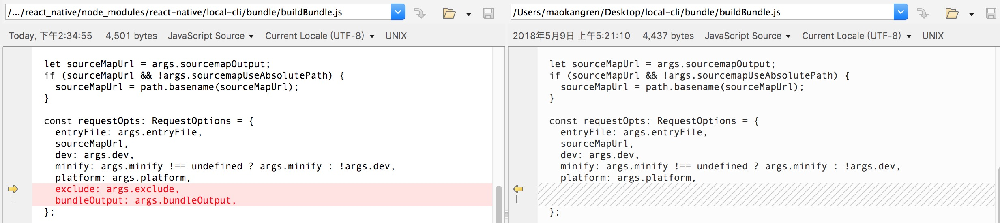

# upgrade

https://react-native-community.github.io/upgrade-helper/?from=0.55.4&to=0.59.10

### 使用 npm install 时报错

[root@localhost helloworld]# npm install forever -g
npm WARN registry Using stale data from https://registry.npmjs.org/ because the host is inaccessible -- are you offline?
npm WARN registry Using stale package data from https://registry.npmjs.org/ due to a request error during revalidation.
npm ERR! code ENOTFOUND
npm ERR! errno ENOTFOUND
npm ERR! network request to https://registry.npmjs.org/forever-monitor failed, reason: getaddrinfo ENOTFOUND registry.npmjs.org registry.npmjs.org:443
npm ERR! network This is a problem related to network connectivity.
npm ERR! network In most cases you are behind a proxy or have bad network settings.
npm ERR! network
npm ERR! network If you are behind a proxy, please make sure that the
npm ERR! network 'proxy' config is set properly. See: 'npm help config'

npm ERR! A complete log of this run can be found in:
npm ERR! /root/.npm/\_logs/2019-07-12T21_28_34_755Z-debug.log
查看 npm 源地址
npm config get registry

#http://registry.npmjs.org 为国外镜像地址
设置阿里云镜像
npm config set registry http://registry.npm.taobao.org

#如果不能解决
npm install -g cnpm --registry=https://registry.npm.taobao.org

### 0: 安装工具

```
npm install -g react-native-cli
npm install -g install-local
```

### 1: 在线调试

-   在纯的 rn 项目开启服务 **npm run start** 查看本地 IP 为 _10.10.10.111_
-   设置 **IP:PORT** _10.10.10.111:8081_ (Dev Settings -> Debug server host & port for device)

### 2: 发布离线包

```
// bundle
react-native bundle  --platform android  --dev true  --entry-file ./index.js  --bundle-output ./build/bundle/assets/index.android.bundle  --assets-dest ./build/bundle/res/

// unbundle
react-native unbundle  --platform android  --dev true  --entry-file ./index.js  --bundle-output ./build/bundle/assets/index.android.bundle  --assets-dest ./build/bundle/res/
```

-   base & business for android

```
react-native   bundle  --platform android --verbose --minify false --dev true  --entry-file ./common_entry.js  --bundle-output ./build/bundle/base/bundle/base.android.bundle --assets-dest ./build/bundle/base/bundle
react-native   bundle  --platform android --verbose --minify false --dev true  --entry-file ./index.js  --bundle-output ./build/bundle/business/bundle/business.android.bundle --assets-dest ./build/bundle/business/bundle --exclude  ./build/bundle/base/bundle/base.android.bundle.json
```

-   base & business for ios

```
react-native   bundle  --platform ios --verbose --minify false --dev true  --entry-file ./common_entry.js  --bundle-output ~/Desktop/base/base.ios.bundle --assets-dest ~/Desktop/base
react-native   bundle  --platform ios --verbose --minify false --dev true  --entry-file ./index.js  --bundle-output ~/Desktop/business/business.ios.bundle --assets-dest ~/Desktop/business --exclude  ~/Desktop/base/base.ios.bundle.json
```

-   normal for android bundle and unbundle

```
react-native unbundle  --platform android  --verbose --minify false --dev true  --entry-file ./index.js  --bundle-output ./build/bundle/normal/unbundle/index.android.bundle --assets-dest ./build/bundle/normal/unbundle
react-native   bundle  --platform android  --verbose --minify false --dev true  --entry-file ./index.js  --bundle-output ./build/bundle/normal/bundle/index.android.bundle --assets-dest ./build/bundle/normal/bundle
```

# Custom Metro To Split Modules For React Native

🚇 Reference Metro From Native Path

-   **🚅 build es6 to es5**:

```
cd ~/workspace/smart-metro
npm run build-clean && npm run build
```

-   **🚅 publish local release**:

```
cd packages/metro
npm run package-release

```

-   **🚅 install local**:

```
npm install -g install-local

cd ~/workspace/ReactNativeProject
rm -rf node_modules/metro
install-local --save ~/workspace/smart-metro/packages-release/metro
```

-   **🚅 install and update local with one key**:

```
cd ~/workspace/smart-metro/ && npm run build-clean && npm run build && cd packages/metro && npm run package-release && cd ~/workspace/template/apps/app-template/react_native && install-local --save ~/workspace/smart-metro/packages-release/metro
```

# node_modules/react-native/local-cli/bundle modify

-   1 bundleCommandLineArgs.js add command

    ```
        command: '--exclude [string]',
        description: 'Manifest file name where modules to exclude are stored, ex. /tmp/manifest.json',
      }, {
    ```

    

-   2 buildBundle.js

    -   from:

        ```
          const requestOpts: RequestOptions = {
            entryFile: args.entryFile,
            sourceMapUrl,
            dev: args.dev,
            minify: args.minify !== undefined ? args.minify : !args.dev,
            platform: args.platform,
          };
        ```

    -   to:
        `const requestOpts: RequestOptions = { entryFile: args.entryFile, sourceMapUrl, dev: args.dev, minify: args.minify !== undefined ? args.minify : !args.dev, platform: args.platform, exclude: args.exclude, bundleOutput: args.bundleOutput, };`
        
